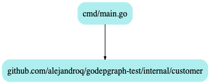

# godepgraph_commithook

Upon a Git commit, the dependecy tree documentation is updated to reflect the current application's package topology. 
In an opinionated `pull_request_template.md` this visual could be leveraged for review and preventing developers from accidently introducing any ungainly package relationships. 
This implementation is particular to Go.

For additional commands and capabilities, look to the Makefile.

Ideally the dependency tree should be short and flat.
Too few packages given a high statement count likely means the application is purely concrete and hasn't declared any bounded contexts (zone of pain).
Too many interwoven packages, with a great height (gives the appearence of a hill), signifies incorrectly asserted bounded contexts (zone of pain).
Short and flat provided an appropriate ratio of statements signifies an application codebase that is potentially a modular monolith which is an ideal for shops expounding characteristics such as discovery and experimentation. An important attribute of the latter is the complexity be maintained low or the code architecture risks being within the zone of uselessness.